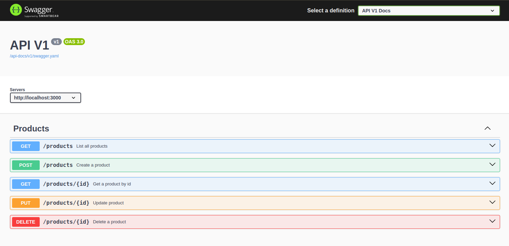

# Product Inventory API 

<p align="center">
Welcome to the Product Inventory API! This project was designed to efficiently manage products, allowing operations such as creation, update, deletion, and retrieval of product information. It also features clear documentation and automated tests to ensure the system's quality.<br/>
</p>

<p align="center">
  
</p>

---

## 🚀 Features  

- **Full CRUD**: Manage products with create, read, update, and delete operations. 
- **Automated Documentation**: Endpoints documented with Swagger for easy use and integration.  
- **Automated Testing**: Test coverage with RSpec to guarantee quality and stability.


## 🛠️ Technologies Used  

- **Ruby on Rails**: Backend framework for API development.  
- **PostgreSQL**: Relational database to store product data.  
- **Swagger/OpenAPI**: Clear and interactive endpoint documentation.  
- **RSpec**: Framework for unit and integration testing.   


### Prerequisites  
Make sure you have the following tools installed on your machine:  
- [Git](https://git-scm.com/).  
- [Ruby 3.4.1](https://www.ruby-lang.org/) and [Rails 8.0.1](https://rubyonrails.org/).  
- [PostgreSQL](https://www.postgresql.org/).  

### Steps  

1. **Clone the repository**:  
   ```bash
   git clone https://github.com/your-account/product-inventory-api.git
   cd product-inventory-api
   ```

2. **Set up environment variables**:  
   Create a `.env` file in the project root and configure the necessary variables, such as database credentials and authentication keys.

3. **Install dependencies**:  
   ```bash
   bundle install
   ```

4. **Run database migrations**:  
   ```bash
   rails db:create db:migrate
   ```

5. **Start the server**:  
   ```bash
   rails server
   ```

6. **Access the API**:  
   The API will be available at `http://localhost:3000`.


## 📖 Documentation  

The complete API documentation is available at: [Swagger UI](http://localhost:3000/api-docs)  

Here you will find details about each endpoint, required parameters, and request examples.


## 🗂️ Project Structure  

```plaintext
product-inventory-api/
├── app/
│   ├── controllers/
│   ├── models/
│   ├── serializers/
│   └── views/
├── config/
├── db/
├── spec/
├── Gemfile
└── README.md
```


## 🗄️ Database Structure  

### Products Table  

| Column         | Type        | Description                |
|----------------|-------------|----------------------------|
| id             | Integer     | Primary key                |
| name           | String      | Product name               |
| description    | Text        | Detailed description       |
| price          | Decimal     | Price of the product       |
| stock_quantity | Integer     | Quantity in stock          |
| created_at     | Timestamp   | Record creation timestamp  |
| updated_at     | Timestamp   | Record update timestamp    |


## 🤝 Contributions  

Contributions are welcome! Feel free to open issues or submit pull requests.

<br/><br/>
---

### Developed by Sarah Schneider 🖖